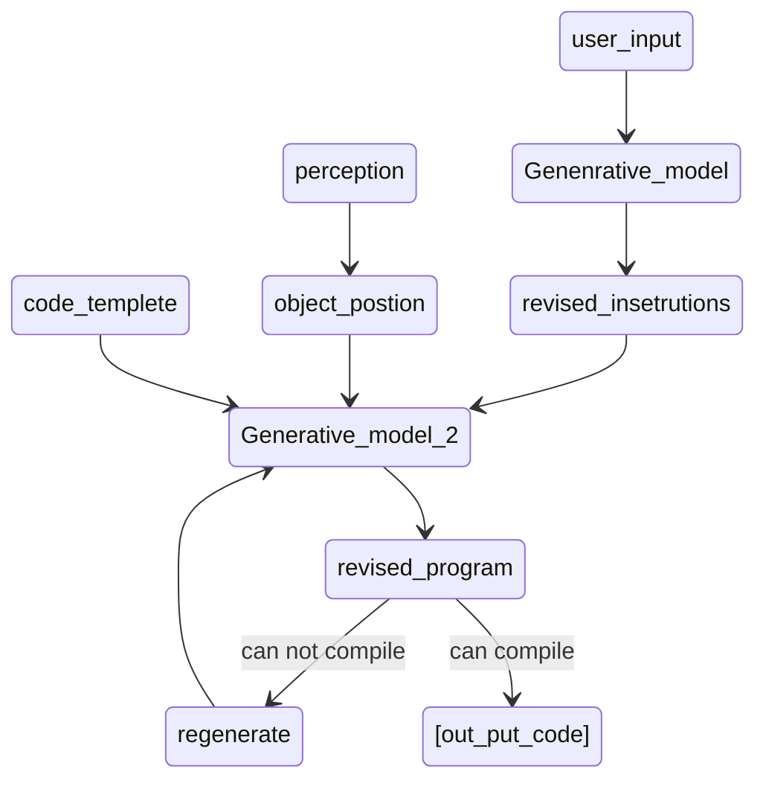

# LLM_ROBOT

## Isaac Gym 仿真
## LLM 交互
- set up: `pip install openai`
This is used for the environment set up for the API of chatgpt.
-  The Basic Control Flow:



## Flexiv 机械臂控制

环境要求:

- [flexiv_rdk (cpp)](https://rdk.flexiv.com/api/index.html) (默认这里的环境配置文件 `rdk_install` 下载到 /home/username/ 路径)

控制部分的代码文件树如下：

``` bash
├── base
│   ├── CMakeLists.txt
│   ├── gripper_test.cpp
│   ├── sine_control_demo.cpp
│   └── main.cpp  # 主程序
├── data_generator.py
├── simulate_datasets  # 仿真指令集
│   ├── calibration.txt
│   ├── gripper_order.txt
│   ├── No_offest_order.txt
│   ├── offset_order.txt
│   ├── order0.txt
│   ├── order1.txt
│   └── readme.md
├── lib
    └── nlohmann
        └── json.hpp  # 用于cpp-json通信

```

这里省略了一些 CMake 相关的编译缓存 cache 文件等，其中，`data_generator.py` 是连接仿真控制指令集与 flexiv 控制实现功能的，这个文件思路是将 指令集 `order.txt` 的内容进行逐行读取并且手动添加一个控制的时间差，再将控制指令发送给 `base/test_every_joint.cpp` 文件

### 控制流程

1. 初始化: 走最小作用路径回到 home 位置

2. 逐个文件读取 order 指令并且按照 1kHz 频率实现实时控制

### 常见问题

1. 由于控制指令完全来自于仿真环境得到的数据集，很多时候机械臂会出现某个关节过快 (或者扭矩过大) 而进入急停的情况，那么有两种常见的可能：

    a. 仿真数据在某两步之间的角度跨度过大, 这也分为单个文件内某两行角度差距过大与两个文件衔接过程中是否存在大角度差，本代码能在完成某一指令并且开始下一指令的时候输出相关信息，可以据此判断角度差发生的节点

    b. 机械臂控制指令的手动设置的读取时间差过小, 即 `data_generator.py` 文件的 `time_span` 的变量需要被适当增大

2. 上位机无法获取和机械臂的通信, 往往是没有连接到机械臂，这时候我们需要查看 ip 地址是否匹配; 或者也有可能是机械臂没有回到 自动(远程) 模式

3. 初始化过程由于走官方自定义程序，会按照最短路径回到 home 位置，因此可能会与环境发生干涉，请注意解决这个问题
